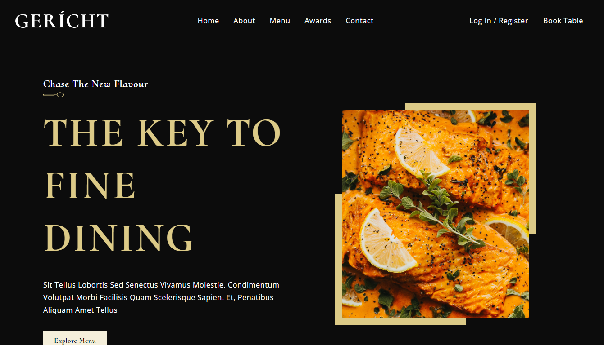
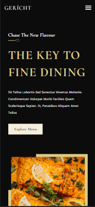

# Gericht Restaurant

## Description

Welcome to my static website! This is a front-end part of the website. Using the highly effective Block Element Modifier (BEM) naming convention and methodology in CSS, I have created a clean and maintainable codebase.

## Website Link

You can access the live website at: [https://ranjan-gericht-restaurant.netlify.app/](https://ranjan-gericht-restaurant.netlify.app/)

## Screenshots

### Desktop View

### Mobile View

## Tech Stack

- React
- CSS3
- JavaScript

## How to Contribute

I appreciate and welcome contributions to improving this website. If you would like to contribute, please follow these steps:

1. Fork the repository.
2. Create a new branch: `git checkout -b feature/your-feature-name`.
3. Make your changes and commit them: `git commit -m "Add your message here"`.
4. Push the changes to your fork: `git push origin feature/your-feature-name`.
5. Create a pull request to the `main` branch of this repository.

I will review your pull request, and if everything looks good, I will merge it into the main branch. Thank you for helping make this website even better!

## Support

If you encounter any issues with the website or have any questions, please feel free to reach out to me at my LinkedIn - [https://www.linkedin.com/in/shubhankar-ranjan/].

I value your feedback and will do my best to assist you with any concerns or queries you may have.
